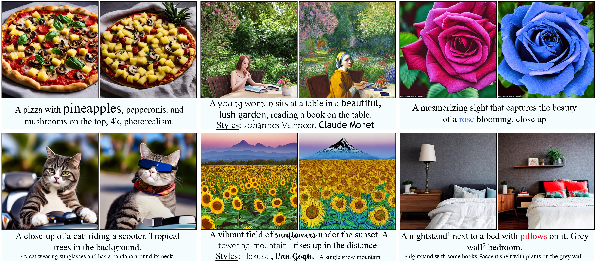
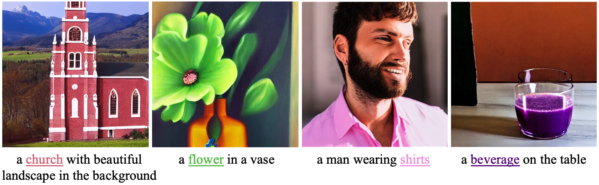
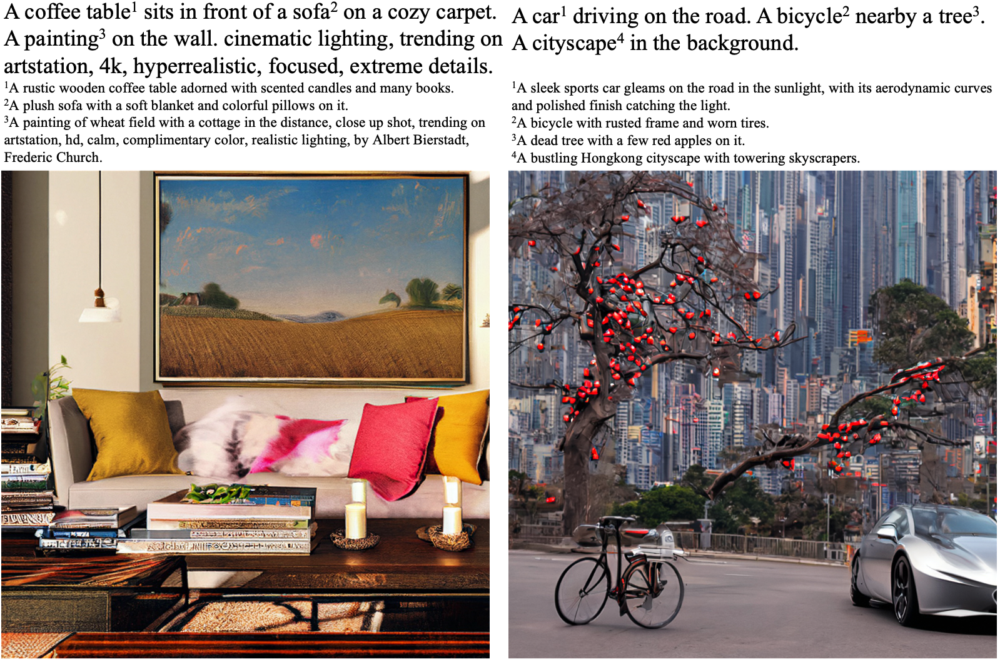
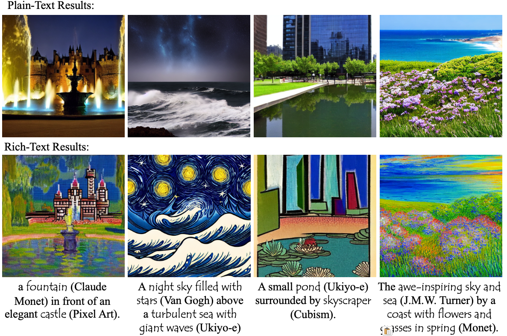
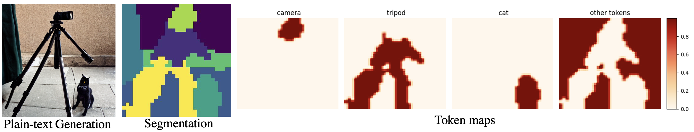

# Rich-Text-to-Image

### [Project Page](https://rich-text-to-image.github.io/) | [Paper](https://arxiv.org/abs/2304.06720) | [Video](https://youtu.be/ihDbAUh0LXk) | [HuggingFace Demo](https://huggingface.co/spaces/songweig/rich-text-to-image) | [A1111 Extension](https://github.com/songweige/sd-webui-rich-text)


**tl;dr:** We use various formatting information from rich text, including font size, color, style, and footnote, to increase control of text-to-image generation. Our method enables explicit token reweighting, precise color rendering, local style control, and detailed region synthesis.


https://github.com/songweige/rich-text-to-image/assets/22885450/ccd186d1-f0fc-4e55-80c0-06afd6cb84c0


***Expressive Text-to-Image Generation with Rich Text*** <br>
[Songwei Ge](https://songweige.github.io/), [Taesung Park](https://taesung.me/), [Jun-Yan Zhu](https://www.cs.cmu.edu/~junyanz/), [Jia-Bin Huang](https://jbhuang0604.github.io/)<br>
UMD, Adobe, CMU<br>
ICCV 2023

## Updates
* [09/26] We initiate an implementation of an [A1111 WebUI extension](https://github.com/songweige/sd-webui-rich-text) for integrating the rich-text editor for text-to-image generation.
* [09/24] We now support LoRA checkpoints. Please find the demo and the latest code in [this branch](https://github.com/songweige/rich-text-to-image/tree/lora).
* [08/09] Our method now support [SD-XL](https://huggingface.co/stabilityai/stable-diffusion-xl-base-1.0) with `--model SDXL`, and various fintuned model like [ANIMAGINE-XL](https://huggingface.co/Linaqruf/animagine-xl) with `--model AnimeXL`.
* [07/14] Our paper is accepted by ICCV 2023.
* [05/03] We update our approach to abtain more robust and accurate token maps and improve the structure preservation from plain-text results. The following images are generated by the new method with the prompt taken from [this issue](https://github.com/SongweiGe/rich-text-to-image/issues/9).
* [04/17] We release the [rich-text-to-image demo](https://huggingface.co/spaces/songweig/rich-text-to-image) on HuggingFace Space. Thanks to [HuggingFace](https://huggingface.co/) team for the help with the demo!
* [04/13] We release the [rich-text-to-image generation](https://arxiv.org/abs/2304.06720), which leverages the formatting options of a rich-text editor to facilitate controlling the text-to-image generation.


## Setup

This code was tested with Python 3.8, [Pytorch](https://pytorch.org/) 1.11 and supports a [Stable Diffusion v1-5](https://huggingface.co/runwayml/stable-diffusion-v1-5) or [Stable Diffusion XL](https://huggingface.co/stabilityai/stable-diffusion-xl-base-1.0) or [ANIMAGINE-XL](https://huggingface.co/Linaqruf/animagine-xl) through hugginface.
```
git clone https://github.com/SongweiGe/rich-text-to-image.git
cd rich-text-to-image/
conda env create -f environment.yaml
pip install git+https://github.com/openai/CLIP.git
conda activate rich-text
```
## Usage
In general, our pipeline contains two steps. We first input the plain text prompt to the diffusion model and compute the cross-attention maps to associate each token with the spatial region. The rich-text prompts obtained from the editor are stored in JSON format, providing attributes for each token span. We use a new region-based diffusion to render each region’s attributes into a globally coherent image. Below we provide the basic usage of various font formats.

### Rich text to JSON
We encode the rich text into JSON format and use it as the input to the rich-text conditioned sampling script `sample.py`. To automatically generate a JSON string based on rich text, you can use our [rich-text-to-json](https://rich-text-to-image.github.io/rich-text-to-json.html) interface, which is a purely static webpage that can be readily incorporated into any rich-text-based application.

### Rich-text JSON to Image


You may start generating images with rich-text JSON via our local gradio demo:

```
python gradio_app.py
```
Or through the command line:
```
python sample.py --rich_text_json 'your rich-text json here'
```

#### Font Color



We use font color to control the precise color of the generated objects. For example, the script below generates "a Gothic church (with color #b26b00) in the sunset with a beautiful landscape in the background."

```
python sample.py --rich_text_json '{"ops":[{"insert":"a Gothic "},{"attributes":{"color":"#fd6c9e"},"insert":"church"},{"insert":" in a sunset with a beautiful landscape in the background.\n"}]}' --num_segments 10 --segment_threshold 0.4 --inject_selfattn 0.5 --inject_background 0.5 --color_guidance_weight 1 --seed 7 --run_dir results/color_example_xl --model SDXL
```

#### Footnote



We use footnotes to provide supplementary descriptions for selected text elements. The following script generates a cat wearing sunglasses and bandana, which is a difficult case as mentioned in [eDiffi](https://research.nvidia.com/labs/dir/eDiff-I/#comparison_stable_cat_scooter).

```
python sample.py --rich_text_json '{"ops":[{"insert":"A close-up 4k dslr photo of a "},{"attributes":{"link":"A cat wearing sunglasses and a bandana around its neck."},"insert":"cat"},{"insert":" riding a scooter. Palm trees in the background.\n"}]}' --seed 3 --inject_background 0.5  --inject_selfattn 0.3 --num_segments 5 --run_dir results/footnote_example_xl --model SDXL
```

#### Font Style



Just as the font style distinguishes the styles of individual text elements, we propose using it to define the artistic style of specific areas in the generation. Here is an example script to generate "a beautiful garden (in the style of Claude Monet) with a snow mountain (in the style of Ukiyo-e) in the background".

```
python sample.py --rich_text_json '{"ops":[{"insert":"a beautiful"},{"attributes":{"font":"mirza"},"insert":" garden"},{"insert":" with a "},{"attributes":{"font":"roboto"},"insert":"snow mountain"},{"insert":" in the background"}]}' --num_segments 10 --segment_threshold 0.5 --inject_background 0.4 --seed 5 --run_dir results/style_example_xl --model SDXL
```

#### Font Size


Font size indicates the weight of each token in the final generation. This is implemented by reweighting the exponential attention score before the softmax at each cross-attention layer. The following example adds more pineapple to a generated pizza:

```
python sample.py --rich_text_json '{"ops": [{"insert": "A pizza with pineapple, pepperoni, and "}, {"attributes": {"size": "60px"}, "insert": "mushroom"}, {"insert": " on the top"}]}' --seed 3 --run_dir results/size_example_xl --model SDXL
```

## Evaluation

### Local style generation

To evaluate the capacity of generating certain styles in a local region, we compute the CLIP similarity between each stylized region and its region prompt with the name of that style. We provide an evaluation script and compare ours with the AttentionRefine method proposed in [Prompt-to-Prompt](https://github.com/google/prompt-to-prompt):
```
python evaluation/benchmark_style.py --save_img --folder eval_style
```

### Precise color generation
We come up with color names in three difficulty levels to measure the capacity of a method to understand and generate a specific color. We evaluate the color accuracy by computing the average L2 distance between the region and target RGB values. The change of distance towards the target color is reported.
```
python evaluation/benchmark_color.py --category html --folder eval_color_html
python evaluation/benchmark_color.py --category rgb --folder eval_color_rgb
python evaluation/benchmark_color.py --category common --folder eval_color_common
```


## Visualize token maps




Every time the function `get_token_maps()` is called, the resulted segmentation and token maps are also visualized and saved locally for debugging purpose. Otherwise, you can manually visualize the map for the tokens in the text prompts with the following script.

```
python visualize_token_maps.py --text_prompt "a camera on a tripod taking a picture of a cat." --token_ids 1 4 10 --num_segments 15 --segment_threshold 0.45 --model SDXL
```

## Citation

``` bibtex
@inproceedings{ge2023expressive,
      title={Expressive text-to-image generation with rich text},
      author={Ge, Songwei and Park, Taesung and Zhu, Jun-Yan and Huang, Jia-Bin},
      booktitle={Proceedings of the IEEE/CVF International Conference on Computer Vision},
      year={2023}
}
```

## Acknowledgement

We thank Mia Tang, Aaron Hertzmann, Nupur Kumari, Gaurav Parmar, Ruihan Gao, and Aniruddha Mahapatra for their helpful discussion and paper reading. We thank AK, Radamés Ajna, and other HuggingFace team members for their help and support with the [online demo](https://huggingface.co/spaces/songweig/rich-text-to-image). Our rich-text editor is built on [Quill](https://quilljs.com/). Our model code is built on [huggingface / diffusers](https://github.com/huggingface/diffusers#readme).
