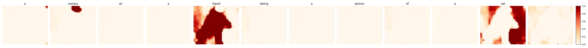

# Rich-Text-to-Image

### [Project Page](https://rich-text-to-image.github.io/) | [Paper](https://arxiv.org/abs/)

**tl;dr:** We explore using versatile format information from rich text, including font size, color, style, and footnote, to increase control of text-to-image generation. Our method enables explicit token reweighting, precise color rendering, local style control, and detailed region synthesis.

<p align="left">
    
</p>

***Expressive Text-to-Image Generation with Rich Text*** <br>
[Songwei Ge](https://songweige.github.io/), [Taesung Park](https://taesung.me/), [Jun-Yan Zhu](https://www.cs.cmu.edu/~junyanz/), [Jia-Bin Huang](https://jbhuang0604.github.io/)<br>
UMD, Adobe Inc., CMU<br>
arXiv, 2023

## Setup

This code was tested with Python 3.8, [Pytorch](https://pytorch.org/) 1.11 and used a pre-trained stable diffusion v1-5 model through [hugginface](https://huggingface.co/runwayml/stable-diffusion-v1-5).
```
git clone https://github.com/SongweiGe/rich-text-to-image.git
cd rich-text-to-image/
conda env create -f environment.yaml
pip install git+https://github.com/openai/CLIP.git
conda activate rich-text
```
## Usage
In general, our pipeline contains two steps. We first input the plain text prompt to the diffusion model and compute the cross-attention maps to associate each token with the spatial region. The rich-text prompts obtained from the editor are stored in JSON format, providing attributes for each token span. We use a new region-based diffusion to render each region’s attributes into a globally coherent image. Below we provide the basic usage of various font formats.

### Rich text to JSON
We encode the rich text into JSON format and use it as the input to the rich-text conditioned sampling script `sample.py`. To automatically generate a JSON string based on rich text, you can use our [rich-text-to-json](https://rich-text-to-image.github.io/rich-text-to-json.html) interface, which is a purely static webpage that can be readily incorporated into any rich-text-based application.

### Rich-text JSON to Image


You may start generating images with rich-text JSON via our local gradio demo:

```
python app_gradio.py
```
Or through the command line:
```
python sample.py --rich_text_json 'your rich-text json here'
```

#### Font Style


Just as the font style distinguishes the styles of individual text elements, we propose using it to define the artistic style of specific areas in the generation. Here is an example script to generate "a beautiful garden (in the style of Claude Monet) with a snow mountain (in the style of Ukiyo-e) in the background".

```
python sample.py --rich_text_json '{"ops":[{"insert":"a "},{"attributes":{"font":"mirza"},"insert":"beautiful garden"},{"insert":" with a "},{"attributes":{"font":"roboto"},"insert":"snow mountain in the background"},{"insert":"\n"}]}' --seed 3
```


#### Font Color


We use font color to control the precise color of the generated objects. For example, the script below generates "a Gothic church (with color #b26b00) in the sunset with a beautiful landscape in the background."

```
python sample.py --rich_text_json '{"ops":[{"insert":"a Gothic "},{"attributes":{"color":"#b26b00"},"insert":"church"},{"insert":" in a the sunset with a beautiful landscape in the background.\n"}]}'
```

#### Font Size


Font size indicates the weight of each token in the final generation. This is implemented by reweighting the exponential attention score before the softmax at each cross-attention layer. The following example adds more pineapple to a generated pizze:

```
python sample.py --rich_text_json '{"ops": [{"insert": "A pizza with "}, {"attributes": {"size": "50px"}, "insert": "pineapples"}, {"insert": ", pepperonis, and mushrooms on the top, 4k, photorealistic\n"}]}' --height 768 --width 896 --negative_prompt 'blurry, art, painting, rendering, drawing, sketch, ugly, duplicate, morbid, mutilated, mutated, deformed, disfigured low quality, worst quality'
```

#### Footnote


We use footnote in the rich text to provide supplementary descriptions to the selected text elements. The following script generates a cat wearing sunglasses and bandana, which is often failed by default as shown in [eDiffi](https://research.nvidia.com/labs/dir/eDiff-I/#comparison_stable_cat_scooter).

```
python sample.py --rich_text_json '{"ops":[{"insert":"A close-up 4k dslr photo of a "},{"attributes":{"link":"A cat wearing sunglasses and a bandana around its neck."},"insert":"cat"},{"insert":" riding a scooter. Palm trees in the background.\n"}]}'
```

## Evaluation

### Local style generation

To evaluate the capacity of generating certain styles in a local region, we compute the CLIP similarity between each stylized region and its region prompt with the name of that style. We provide an evaluation script and compare ours with the AttentionRefine method proposed in [Prompt-to-Prompt](https://github.com/google/prompt-to-prompt):
```
python evaluation/benchmark_style.py
```

### Precise color generation
We come up with color names in three difficulty levels to measure the capacity of a method to understand and generate a specific color. We evaluate the color accuracy by computing the average L2 distance between the region and target RGB values. The change of distance towards the target color is reported.
```
python evaluation/benchmark_color.py --category html
```


## Visualize token maps




Every time the function `get_token_maps()` is called, the resulted token maps are also visualized and saved locally for debugging purpose. Otherwise, you can manually visualize the map for every token in the text prompts with the following script.

```
python visualize_token_maps.py --text_prompt "a camera on a tripod taking a picture of a cat."
```

## Citation

``` bibtex
@article{ge2023expressive,
    title={Expressive Text-to-Image Generation with Rich Text},
    author={Ge, Songwei and Park, Taesung and Zhu, Jun-Yan and Huang, Jia-Bin},
    journal={arXiv preprint arXiv:},
    year={2023}
}
```

## Acknowledgement

We thank Mia Tang, Aaron Hertzmann, Nupur Kumari, Gaurav Parmar, Ruihan Gao, and Aniruddha Mahapatra for their helpful discussion and paper reading. Our rich-text editor is built on [Quill](https://quilljs.com/). Our model code is built on [huggingface / diffusers](https://github.com/huggingface/diffusers#readme).
